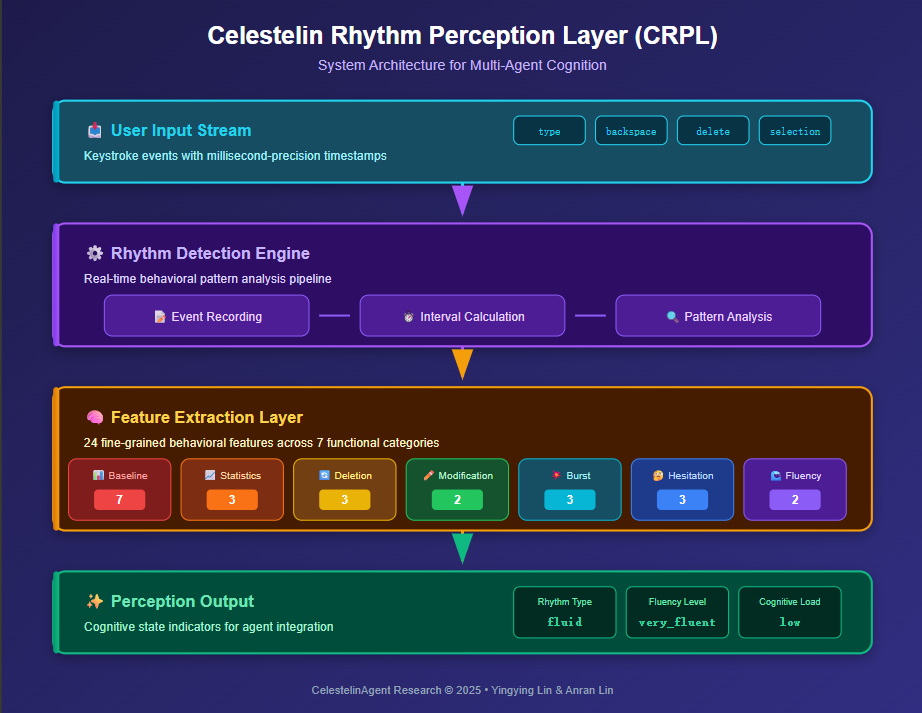

<p align="center">
  <h1 align="center">🎹 CRPL — Celestelin Rhythm Perception Layer</h1>
  <p align="center">
    <i>A fine-grained keystroke rhythm perception framework for human cognition-aware AI agents</i>
  </p>
  <p align="center">
    
    
    
    
    
  </p>
</p>

---

> **"The typing patterns humans produce are not noise to be filtered — they are signals worth perceiving."**

CRPL is a novel framework that models keystroke rhythm as a **perceptual signal** for inferring users' cognitive and emotional states. Unlike traditional keystroke dynamics research focused on security authentication, CRPL positions typing rhythm as a foundation for **AI agent perception and empathetic response generation**.



## ✨ Key Features

- **24 Fine-Grained Behavioral Features** organized into 7 functional categories
- **Real-Time Rhythm Detection** with millisecond-precision timestamps
- **Dual-Layer Rhythm Model** for Chinese Pinyin input — capturing cognitive translation process
- **4 Cognitive Mode Detection**: Expressive, Narrative, Deliberative, Deep Thinking
- **Cross-Language Support** including Chinese IME (Pinyin) composition events
- **Agent Integration Patterns** for LLM-based systems
- **Interactive Demo Tools** — HTML (zero-dependency), Python GUI, and React

## 🧠 Key Discovery

CRPL captures **cognitive processing modes** rather than emotional states alone:

| Mode | Information State | Rhythm Signature |
|------|------------------|-----------------|
| **Expressive** | Known + Certain | fluid, very_fluent, CPM>120 |
| **Narrative** | Known + Recalled | uneven but fluent |
| **Deliberative** | Unknown + Uncertain | hesitant, thoughtful pauses |
| **Deep Thinking** | Complex + Constructive | fragmented, consistency→0 |

**Information certainty influences typing rhythm more directly than emotional valence.**

## 📊 Feature Categories

| Category | Fields | Description | Psychological Mapping |
|----------|--------|-------------|----------------------|
| 📐 Baseline Metrics | 7 | Core rhythm signature | Task engagement, focus level |
| 📈 Basic Statistics | 3 | Aggregate metrics | Cognitive effort, persistence |
| 🔄 Deletion Analysis | 3 | Self-correction patterns | Uncertainty, perfectionism |
| ✏️ Modification Analysis | 2 | Intent revision behavior | Decision stability |
| 💥 Burst Detection | 3 | Rapid typing segments | Emotional arousal, inspiration |
| 🤔 Hesitation Mapping | 3 | Pause location distribution | Cognitive load, word search |
| 🌊 Fluency Scoring | 2 | Overall fluency assessment | Flow state, task proficiency |
| 📝 Trajectory | 1 | Complete event history | Behavioral audit trail |

## 🚀 Try It Now

### ⭐ HTML Demo (Recommended — Zero Dependencies!)

Just open in any browser. No installation needed:

```
demo/CRPL_RhythmDetectorPro.html
```

Double-click the file → type anything (Chinese or English) → click **Analyze** → see your rhythm profile!

### Python GUI Demo

```bash
cd demo
python test_gui.py
```

Works on Windows/Mac/Linux. Full Chinese IME support. No additional packages needed.

### Python Library Usage

```python
from crpl import RhythmDetector

detector = RhythmDetector()
detector.start_monitoring()

# Record keystrokes (integrate with your input handler)
detector.record_keystroke('H', 'type')
detector.record_keystroke('e', 'type')
# ... more keystrokes ...

results = detector.finish_monitoring("Hello!")
print(results['rhythm_type'])    # e.g., 'fluid'
print(results['fluency_level'])  # e.g., 'very_fluent'
print(results['consistency'])    # e.g., 0.82
```

## 🇨🇳 Dual-Layer Rhythm Model

A key innovation: Chinese Pinyin input has a **dual-layer rhythm** invisible to English-only systems.

```
English: H → e → l → l → o → [done]
         └─────────────────────────┘
         Single layer: physical rhythm = expression rhythm

Chinese: n → i → [select "你"] → h → a → o → [select "好"]
         ├── Layer 1: Pinyin encoding rhythm (physical)
         └── Layer 2: Candidate selection rhythm (cognitive)
```

| Characteristic | English | Chinese (Pinyin) |
|---------------|---------|-----------------|
| Keystroke-to-char ratio | ≈1:1 | 3:1 to 6:1 |
| Rhythm layers | Single | Dual (physical + cognitive) |
| Pause meaning | Thinking | Thinking OR word selection |
| Deletion meaning | Spelling correction | Pinyin OR candidate reselection |

## 📁 Repository Structure

```
CRPL/
├── README.md
├── requirements.txt
├── LICENSE
├── crpl/
│   ├── __init__.py
│   ├── detector.py          # Core RhythmDetector class
│   └── types.py             # Data types and enums
├── demo/
│   ├── CRPL_RhythmDetectorPro.html  ⭐ Zero-dependency web demo!
│   ├── test_gui.py                   Python GUI demo
│   └── RhythmDetectorPro.jsx         React source
└── docs/
    ├── CRPL_Architecture.png          System architecture diagram
    ├── Case 1 Expressive (steady_fast).png
    ├── Case 2 Narrative (uneven).png
    ├── Case 3 Deliberative (hesitant).png
    └── Case 4 Deep Thinking (hesitant).png
```

## 📄 Publications

- **Full Paper:** Y. Chen and A. Lin, "Affective Typing Patterns: A Fine-Grained Keystroke-Rhythm Perception Layer for Multi-Agent Cognition Systems," 2025. DOI: [10.13140/RG.2.2.11079.15525](https://doi.org/10.13140/RG.2.2.11079.15525)
- **Demo:** Accepted for presentation at HHAI 2026 (Hybrid Human-Artificial Intelligence), Brussels, Belgium, July 2026. *(update after notification)*

## 📝 Citation

```bibtex
@article{chen2025crpl,
  title={Affective Typing Patterns: A Fine-Grained Keystroke-Rhythm
         Perception Layer for Multi-Agent Cognition Systems},
  author={Chen, Yingying and Lin, Anran},
  year={2025},
  doi={10.13140/RG.2.2.11079.15525}
}
```

## 📄 License

MIT License — see [LICENSE](LICENSE) for details.

## 👥 Authors

- **Yingying Chen** (Aria Chen) — Independent Researcher, Calgary, Canada
- **Anran Lin** — CelestelinAgent Research Group

## 🙏 Acknowledgments

This work is part of the [CelestelinAgent](https://github.com/CelestelinAgent) project, exploring new dimensions of human-AI interaction through cognitive perception, identity infrastructure, and continuous relational architecture.

---

<p align="center">
  💜 CelestelinAgent Research © 2025
</p>
